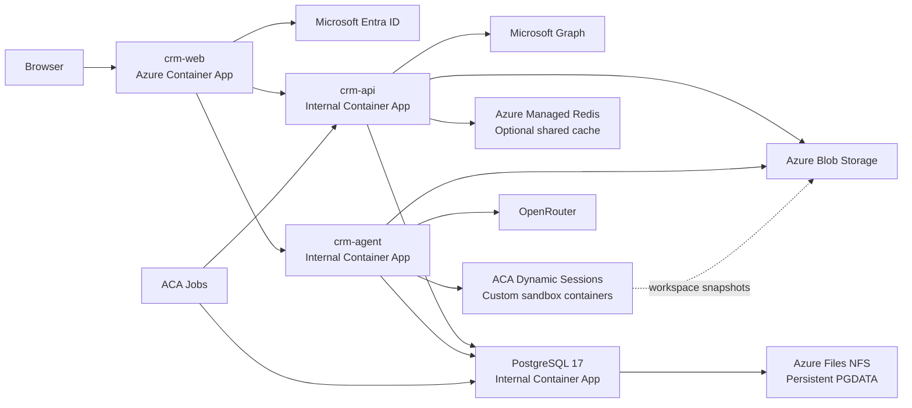
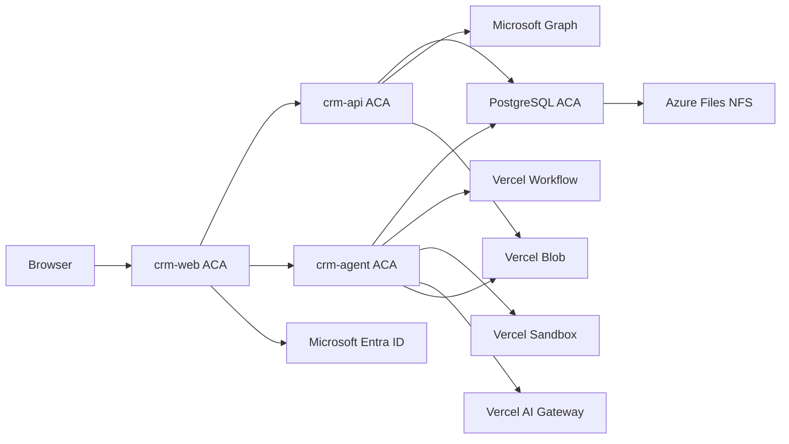

# Risk Professionals Azure Migration Implementation Plan

## Status

Execution in progress. The source and external-service foundations below have been implemented and validated, but both CRM deployment kill switches remain disabled. This document still does not authorize a production cutover by itself; the open acceptance gates remain mandatory.

## Execution progress — 2026-08-06

### Completed and validated

- [x] Raise the runtime requirement to Node 24 and retain the repository Bun 1.3.12 pin.
- [x] Add Debian/glibc, non-root web, API, and agent container images.
- [x] Enable Next.js standalone output and split `APP_URL` from server-only `API_INTERNAL_URL`.
- [x] Add web liveness plus API liveness/readiness probes and container smoke tests.
- [x] Create the separate single-tenant `Risk Professionals CRM` Entra registration, redirect URIs, optional email claim, delegated Graph permissions, admin consent, assignment boundary, and protected GitHub configuration.
- [x] Add native Better Auth Microsoft sign-in with tenant enforcement, stable `${tid}:${oid}` provider identity, disabled profile-photo loading, explicit account linking, and no implicit/different-email linking.
- [x] Add Microsoft sign-in and authenticated account-linking UI while retaining Google as the temporary recovery/mailbox path.
- [x] Create and verify the Vercel Blob store in `syd1`, including write/read/delete acceptance.
- [x] Create and verify the Vercel AI Gateway key and a real `zai/glm-5.2-fast` completion.
- [x] Select Vercel Sandbox explicitly and prove Node 24 sandbox creation with `deny-all` egress.
- [x] Bring Stage 2 forward: pin `@workflow/world-postgres@5.0.0-beta.30`, select it explicitly in eve, add an idempotent bootstrap command, and complete a real model turn with durable runs/events/steps in PostgreSQL.
- [x] Add the agent image and prove it starts with PostgreSQL Workflow, Vercel Sandbox, and AI Gateway without embedding runtime secrets.
- [x] Add rollback-compatible provider-neutral sync schema expansion and backfill migrations without removing Google fields, enums, keys, or indexes.
- [x] Make Google dispatch provider-aware and dual-read/write provider-neutral state so future Microsoft rows cannot be interpreted as Gmail.
- [x] Prove the previous Google revision boots against the expanded schema before Microsoft sync rows exist.
- [x] Add atomic mailbox leases with `FOR UPDATE SKIP LOCKED` and prove concurrent claim exclusion plus expiry recovery.
- [x] Add Microsoft token refresh/consent classification, Graph host enforcement, throttling/reset/error handling, immutable-ID mail delta clients, and fixed-window calendar delta clients.
- [x] Implement crash-safe Microsoft mail and calendar delta persistence, reconciliation generations, tombstones, folder moves, fixed-window rebasing, bounded leased orchestration, provider-neutral timeline links, Graph connection controls, and the mandatory Microsoft-primary consent gate.
- [x] Add the portable PostgreSQL 17 ACA wrapper with fail-closed server startup, explicit one-time CRM/Workflow initialization, and atomic compressed logical backups.
- [x] Run the complete repository validation suite: typecheck, lint, migrations, builds, rollback compatibility, and 512 passing tests.

### In progress and still required before staging

- [x] Implement crash-safe Microsoft mail delta baseline/incremental page application, tombstones, folder moves, and `410` reconciliation.
- [x] Implement Microsoft calendar delta persistence, recurrence/occurrence identity, tombstones, fixed-window horizon advancement, and `410` reconciliation.
- [x] Add provider-neutral sync orchestration, Microsoft connection procedures, ACA Job endpoint, and bounded scheduled/manual execution.
- [x] Replace Google grant/connection/timeline surfaces with Microsoft Graph consent, reconnect, status, sync, purge, and provider-neutral links.
- [ ] Complete real-tenant Entra callback, account-linking, refresh-token rotation, revoked-consent, throttling, paging, and crash-replay acceptance.
- [ ] Merge this source revision, pull the reviewed squashed subtree into `Risk-Professionals/directory`, and retain both directory/source provenance markers.
- [ ] Add and review the separate CRM VNet, ACA environments, Key Vault, identities, PostgreSQL NFS storage, migration/Workflow bootstrap/backup Jobs, DNS, certificates, deployment workflows, smoke tests, and rollback operations.

### Production gates remain open

- [ ] No CRM application or database has been deployed to Azure.
- [ ] No production database cutover or production write acceptance has occurred.
- [ ] PostgreSQL replacement, backup/restore, parked-workflow recovery, and scheduled-work recovery drills have not run on ACA.
- [ ] Microsoft Graph has not replaced Gmail/Google Calendar yet, so Google credentials must not be retired.
- [ ] `CRM_STAGING_READY` and `CRM_PRODUCTION_READY` remain `false`.

## Objective

Run the Risk Professionals CRM application stack on Azure Container Apps first, while retaining the currently working Vercel-managed eve dependencies. Replace those dependencies one at a time until all application infrastructure is on Azure.

The final target has no Vercel-hosted infrastructure dependency. OpenRouter remains the inference provider. Microsoft Entra ID provides primary CRM authentication, and Microsoft Graph provides mailbox and calendar access. Configured SSO providers and optional research providers such as Context, Perplexity, RapidAPI, and GitHub remain external business integrations rather than hosting infrastructure.

The final target removes Google OAuth, Gmail/Google Calendar integration, Vercel Workflow, Vercel Sandbox, Vercel Blob, and Vercel AI Gateway.

## Migration strategy

The migration is deliberately split into independently gated stages with explicit rollback or forward-only cutover contracts:

1. Run the applications and PostgreSQL on Azure Container Apps while retaining Vercel Workflow, Sandbox, Blob, and AI Gateway; replace primary CRM sign-in with Microsoft Entra ID and migrate mailbox/calendar access to Microsoft Graph.
2. Move eve workflow durability to the PostgreSQL world.
3. Replace Vercel Sandbox with a custom eve sandbox backend using Azure Container Apps Dynamic Sessions.
4. Replace Vercel Blob with Azure Blob Storage.
5. Replace Vercel AI Gateway with OpenRouter.
6. Remove the remaining Vercel configuration and harden operations.

The Stage 0 Vercel Workflow spike selected the documented fallback that brings Stage 2 forward. The implemented Stage 1 agent therefore uses PostgreSQL Workflow from its first Azure deployment; Vercel Workflow is no longer part of the transitional runtime.

Each stage must leave a working deployment. Stage 1 deliberately establishes the Azure compute and database foundation; after that foundation, workflow, sandbox, image storage, and inference boundaries must be changed in separate releases.

## Hard requirements for Azure independence

Two pieces of eve infrastructure must be replaced before the deployment can be considered Azure-native:

1. **Workflow durability:** use `@workflow/world-postgres` against the self-hosted PostgreSQL instance so workflow runs, steps, hooks, waits, streams, and queue state survive agent replacement.
2. **Sandbox execution:** implement a public-interface eve `SandboxBackend` backed by Azure Container Apps Dynamic Sessions custom container sessions, with deny-all egress and durable `/workspace` snapshot and restore.

OpenRouter is a separate inference migration. It is not an Azure infrastructure requirement, but it is required to remove Vercel AI Gateway.

## Migration principles

- Keep a known-good deployment at the end of every stage.
- Treat Stage 1 as the Azure compute and database foundation; after it, change only one external provider stateful boundary at a time.
- Define whether each cutover is reversible or forward-only. Keep rollback available until the new provider has passed its recovery tests, and never imply that two incompatible state stores can be merged.
- Never put database credentials or application secrets in a model-controlled sandbox.
- Preserve the repository rule that intelligence belongs in `apps/agent`, not `apps/api`.
- Keep one root `.env.example` as the configuration contract.
- Keep the agent at one replica until workflow, sandbox, and model/vendor concurrency have explicit global limits.
- Treat CRM data, eve workflow state, sandbox workspace state, and mirrored images as separate persistence planes.
- Build production artifacts without production credentials.

## Repository and deployment ownership

The deployment is assembled through a reviewed one-way repository flow:

```text
trycompai/crm
      |
      | reviewed upstream merge
      v
Risk-Professionals/crm
      |
      | reviewed squashed subtree pull
      v
Risk-Professionals/directory/crm/
      |
      | root GitHub Actions and Bicep
      v
Azure
```

The repositories have separate responsibilities:

| Repository or path | Responsibility |
| --- | --- |
| `trycompai/crm` | External upstream project. It is never a deployment source. |
| `Risk-Professionals/crm` | Curated source fork for reviewed portable CRM changes and upstream integration. |
| `Risk-Professionals/directory` | Canonical deployment repository, Azure infrastructure, release history, and production authority. |
| `Risk-Professionals/directory/crm/` | Squashed Git subtree containing the complete CRM Bun and Turborepo workspace. |

Use `crm/` as the subtree prefix. Do not place it under `apps/crm/`; the imported workspace already owns `apps/` and `packages/`. Use `--squash` for the initial import and every future pull. Do not mix squashed and unsquashed subtree operations, automate updates directly into `main`, or use routine `git subtree push` back to the source fork.

A source-fork update does not change or deploy the directory copy. From a clean review branch in `Risk-Professionals/directory`, run:

```bash
./scripts/update-crm-subtree.sh
```

The script verifies the local `crm-source` remote, fetches `Risk-Professionals/crm/main`, and runs the equivalent of:

```bash
git fetch crm-source main
git subtree pull --prefix=crm crm-source main --squash
```

`git fetch` alone only updates the local `crm-source/main` reference; it does not update `directory/crm/`. The resulting subtree commit must pass the root CRM CI workflow and be merged through review before it becomes deployable. Remote definitions are local Git configuration, so every new operator checkout must configure `crm-source` as documented in `directory/docs/crm-subtree.md`.

Portable CRM changes should normally be made in `Risk-Professionals/crm` and pulled into the deployment repository. Risk Professionals deployment customizations may be made under `directory/crm/`. If such a change should return upstream, port it into a focused source-fork branch rather than making synchronization bidirectional.

### Deployment declaration boundary

The subtree import does not itself deploy anything. Deployment declarations live in the root of `Risk-Professionals/directory`, outside the subtree, while application source and container packaging remain inside `directory/crm/`:

| Concern | Owning path or system |
| --- | --- |
| CRM application source, Prisma schema, migrations, health endpoints, and web/API/agent Dockerfiles | `directory/crm/` |
| Azure topology, networking, identities, Key Vault references, storage, Container Apps, and ACA Jobs | `directory/infra/crm/` |
| CRM CI | `directory/.github/workflows/crm-ci.yml` |
| Staging deployment and smoke tests | `directory/.github/workflows/deploy-crm-staging.yml` |
| Production digest promotion and rollback | `directory/.github/workflows/deploy-crm-production.yml` |
| Entra application bootstrap and operations | `directory/docs/crm-entra-bootstrap.md` plus the external Microsoft Entra tenant |
| Runtime configuration contract | `directory/crm/.env.example` |
| Runtime secrets | Protected GitHub environments to Key Vault to ACA secret references |

GitHub only executes workflows under the deployment repository's root `.github/workflows/`. Workflows retained under `directory/crm/.github/workflows/` are imported source history and are inert in the directory repository.

Build every CRM image with `directory/crm` as the build context so the Bun lockfile and workspace packages remain together. Do not absorb the CRM into a root directory-repository workspace and do not use the whole directory repository as the container context. The build may select service-specific Dockerfiles relative to that context:

```bash
az acr build \
  --registry "$ACR_NAME" \
  --image "crm-web:${GITHUB_SHA}" \
  --file apps/app/Dockerfile \
  crm
```

Keep the existing directory tools and their production-only Easy Auth deployment unchanged. CRM receives separately bounded staging and production infrastructure, separate CRM deployment workflows, and a separate Entra application registration. The existing fixed three-app Bicep topology and shared ACA Easy Auth registration are not the CRM foundation.

Record both the directory deployment commit and the imported CRM subtree source commit in release evidence. Images are built and promoted from the directory commit; the subtree split marker records the reviewed source-fork version.

## Final target architecture



## State ownership

| State | Final owner | Recovery expectation |
| --- | --- | --- |
| CRM records and settings | Prisma tables in PostgreSQL | Survives all app and database container replacements through NFS-backed `PGDATA` |
| `AgentTask`, `AgentEvent`, and `AgentConversation` | Prisma tables in PostgreSQL | Survives app replacement and remains the durable CRM queue/audit surface |
| Eve runs, steps, hooks, waits, stream chunks, and workflow queue | `@workflow/world-postgres` | Survives agent replacement and resumes from the last durable workflow checkpoint |
| Sandbox `/workspace` | ACA Dynamic Session plus Azure Blob snapshot | Survives session expiry by restoring into a replacement Dynamic Session |
| Mirrored company/contact/user images | Azure Blob Storage | Content-addressed and browser-readable under the selected delivery policy |
| API cache | Azure Managed Redis or process memory | Disposable; never a system of record |

---

# Stage 0 — Compatibility spikes and migration controls

## Goal

Prove the transitional Vercel-on-ACA architecture before committing to Stage 1, and add the provider boundaries needed for one-at-a-time cutovers.

## Critical Vercel Workflow constraint

Eve 0.29.4 automatically uses Vercel Workflow on Vercel and a local filesystem world under self-hosted `eve start`. Vercel Workflow from a fully self-hosted ACA agent is not established by the current repository or the bundled eve self-hosting guide.

Stage 1 therefore has a blocking spike:

- Prove that a supported Vercel Workflow world can execute against an ACA-hosted eve service and deliver both workflow route families.
- Prove that parked sessions resume after replacing the ACA agent replica.
- Do not claim Stage 1 completion based only on a model response or an `/eve/v1/health` response.

If this is not supported, use one of these fallbacks without changing the rest of Stage 1:

1. Bring Stage 2 forward and use `@workflow/world-postgres` immediately.
2. As a strictly temporary single-replica bridge, mount Azure Files at `.eve/.workflow-data` and use eve's local world. This bridge must not be used for horizontal agent scaling.

The plan must not silently use ephemeral `.eve/.workflow-data` in ACA.

## Required spikes

### Vercel Workflow

Prove:

- The world can be selected explicitly from a non-Vercel host.
- Workflow callbacks can reach the ACA agent.
- `/eve/*` and `/.well-known/workflow/*` are both routed unchanged.
- Workflow authentication does not depend on an untrusted public endpoint.
- A parked conversation survives ACA replica replacement.

Stage 1 otherwise keeps the agent internal, so the spike must choose one concrete callback path:

1. A narrowly exposed agent ingress route restricted to authenticated Workflow callbacks, or
2. A web/edge proxy for `/.well-known/workflow/*` that does not require a Better Auth browser session and validates Workflow authentication before forwarding.

The existing `/eve/v1/*` web proxy is not sufficient because it requires a signed-in user and does not forward Workflow callbacks. An external callback test must prove the selected route.

### Vercel Sandbox

Select the Vercel sandbox backend explicitly rather than relying on `defaultBackend()`:

- Confirm the required Vercel project credentials work from ACA.
- Confirm sandbox creation and template preparation work outside Vercel compute.
- Confirm `deny-all` egress is applied.
- Confirm server shutdown releases sandbox compute while keeping the Vercel session reattachable.

### Vercel AI Gateway

- Use `AI_GATEWAY_API_KEY`; ACA has no Vercel OIDC identity.
- Complete an eve turn containing a tool call and streamed response.
- Confirm catalog access from the API.

### Vercel Blob

- Use `BLOB_READ_WRITE_TOKEN` from ACA.
- Mirror and render one company image and one contact image.

## Migration controls

Introduce temporary provider switches only where needed to make cutovers reversible:

- Workflow world selection is controlled by the deployed agent revision.
- Sandbox provider supports `vercel` and `azure` during the rollback window.
- Blob provider supports `vercel` and `azure` during the migration window.
- Model provider supports `vercel` and `openrouter` during the inference migration.

Remove migration-only switches in the final stage.

## Entry gate

- Target Azure region and subscription selected.
- ACA Dynamic Sessions custom container support and quota confirmed in that region.
- Vercel service credentials available for the transitional deployment.
- A staging hostname and OAuth callback configuration are available.

## Exit gate

- Every transitional Vercel dependency has a proven ACA call path.
- The Workflow spike has either passed or selected one of the documented fallbacks.
- The selected Workflow callback route and authentication policy are documented and tested externally.
- No production build requires live production database credentials.

---

# Stage 1 — Run the application stack on ACA with Vercel services retained

## Goal

Move application compute and PostgreSQL to Azure while preserving Vercel Workflow, Vercel Sandbox, Vercel Blob, and Vercel AI Gateway. Replace Google as the CRM identity provider with Microsoft Entra ID during this foundation stage, then replace Gmail and Google Calendar access with Microsoft Graph before removing Google OAuth credentials.

## Stage 1 topology



## Container applications

Create separate Container Apps in one ACA environment:

- `crm-web`: public ingress.
- `crm-api`: internal ingress.
- `crm-agent`: internal ingress, `minReplicas: 1`, `maxReplicas: 1`.
- `crm-postgres`: internal TCP ingress, `minReplicas: 1`, `maxReplicas: 1`.

While Vercel Workflow remains, expose only the authenticated callback path selected in Stage 0. This may be a narrow edge/web proxy even though the agent itself remains internal. Remove that temporary callback exposure after Stage 2.

Do not combine these processes into one container or one Container App.

## Runtime and build work

1. Raise the repository Node requirement to Node 24 because eve 0.29.4 requires Node 24.
2. Pin Bun to the repository-declared version in development, CI, and images.
3. Add Debian/glibc multi-stage images for web, API, and agent.
4. Build from the repository root so workspace packages and the Bun lockfile remain consistent.
5. Ensure the API runtime contains its externally resolved packages and generated Prisma client.
6. Enable and validate a production Next.js packaging strategy. If using standalone output, verify traced workspace packages, Prisma, static files, and `public` assets.
7. Remove build-time database reads where possible. A build may use a non-routable validation URL, but it must never require production database access.
8. Add a stable web health endpoint, shallow API liveness, API database readiness, and eve `/eve/v1/health` probes.
9. Verify `SIGTERM` reaches Bun, Next, and eve and that shutdown is given enough time to drain.

## Public and internal URLs

The current configuration conflates the public auth/API origin with the internal API service address. Split them.

- Public application origin is used for Better Auth, Microsoft OAuth, SSO callbacks, trusted origins, and browser redirects.
- Internal API URL is used only by the Next.js server proxy and other server-to-server calls.
- Internal agent URL is used only by the web and API services.

Preserve same-origin browser routes:

- `/api/*` through `apps/app/app/api/[...path]/route.ts`.
- `/eve/v1/*` through `apps/app/app/eve/v1/[...path]/route.ts`.

The browser must not learn the internal agent origin.

## Stage 1A — Microsoft Entra ID sign-in

Microsoft Entra ID replaces Google as the built-in CRM sign-in provider. The existing configurable OIDC SSO feature remains available, but Microsoft is the default button and recovery path for this deployment.

### Entra application registration

Create a single-tenant Microsoft Entra application registration with:

- Supported account type restricted to the Risk Professionals tenant.
- Redirect URI `<PUBLIC_APP_URL>/api/auth/callback/microsoft`.
- Separate redirect URIs for local and staging environments.
- A client secret stored in Key Vault.
- The tenant ID recorded as non-secret deployment configuration.
- Delegated permissions required by the Graph stage below.

Declare in `.env.example`, API validation, Turbo configuration, Key Vault, and ACA:

- `MICROSOFT_CLIENT_ID`.
- `MICROSOFT_CLIENT_SECRET`.
- `MICROSOFT_TENANT_ID`.

The client ID and tenant ID may be ordinary configuration; the client secret must be a secret reference.

### Better Auth configuration

Update `packages/auth/src/env.ts` and `packages/auth/src/auth.ts` to configure `socialProviders.microsoft` with the tenant GUID through Better Auth's `tenantId` option. Keep `authority` as the standard authority base unless a reviewed CIAM deployment requires another base; do not embed the tenant twice in the authority URL. Use `signIn.social({ provider: "microsoft" })` from the sign-in UI.

Update account linking so Microsoft is trusted for explicit linking, but set `disableImplicitLinking: true`. Microsoft email must never cause automatic linking. Existing users link Microsoft through `linkSocial()` while authenticated with their existing Google or SSO account. Do not enable different-email linking. Keep Google trusted only during the mailbox migration window if existing users must link or retain Google accounts.

Do not use the Microsoft `email` claim as the primary authorization boundary. Microsoft documents that managed-user email can be absent, tenant-mutable, and unverified. Use:

- Tenant restriction through `MICROSOFT_TENANT_ID` as the primary installation boundary.
- Microsoft object ID (`oid`) plus tenant ID (`tid`) as the stable provider identity.
- A reviewed Better Auth profile mapping that stores the account identity as `${tid}:${oid}` rather than accepting the provider's default `sub` mapping implicitly.
- `ALLOWED_SIGN_IN` only as an additional product allow-list and as the existing internal/external participant classification source, not as proof of Microsoft identity.

Request the email optional claim where useful for user display, and provide a reviewed `mapProfileToUser` fallback for managed users without a usable email claim. The application still requires a canonical user email for CRM membership and sync attribution, so sign-in must fail with a clear configuration/account message when no approved canonical address can be established. A UPN/email rename must retain the same Better Auth account and CRM user through the stable `${tid}:${oid}` identity.

Set Better Auth's Microsoft `disableProfilePhoto: true` during sign-in. Fetch and mirror a profile image separately through an application-owned path if required; never allow a base64 Microsoft profile image into session cookies or response headers.

### Sign-in and configuration surfaces

Replace Google-specific sign-in behavior in:

- `apps/app/app/(landing)/sign-in/page.tsx`.
- `apps/app/app/(landing)/sign-in/google-sign-in.tsx` with a Microsoft equivalent.
- `apps/api/src/sso/sso.service.ts` and its `signInOptions` response.
- Sign-in tests, proxy tests, UI copy, logos, and README instructions.

The public sign-in options procedure must report Microsoft availability. An installation with neither Microsoft nor configured SSO must show an actionable configuration message rather than an empty sign-in page.

### Existing users and account linking

Before disabling Google sign-in:

1. Inventory users and their Better Auth `Account` rows.
2. Confirm Microsoft returns the same canonical email for each intended user.
3. While authenticated as the existing user, call the explicit Microsoft `linkSocial()` flow; do not rely on a matching email during a new sign-in.
4. Verify account-ID collision, mismatched-email, and failed-linking paths cannot create or attach the wrong user.
5. Verify workspace membership, owner/admin roles, conversations, and synced records remain attached to the original user ID.
6. Keep an administrative recovery procedure until every required user has a Microsoft account row.

Do not delete Google account rows during the identity cutover if they are still needed to read Gmail/Calendar during Stage 1B.

## Stage 1B — Microsoft Graph mail and calendar migration

Google OAuth currently serves two purposes: authentication and Gmail/Calendar authorization. Replacing only the sign-in button would leave the CRM's sync capability dependent on Google. Stage 1B replaces the data integration with Microsoft Graph.

If Risk Professionals intentionally wants Microsoft sign-in while retaining Gmail/Google Calendar as an optional linked connection, this subsection may be split into a later release. Google OAuth cannot be removed completely until this subsection is complete.

### Delegated permissions

Request the minimum delegated Microsoft scopes needed for the current behavior. Better Auth's Microsoft provider already supplies its standard identity scopes; add only the provider scopes not already included and verify the final authorization request contains:

- `openid`.
- `profile`.
- `email` where available.
- `offline_access`.
- `User.Read`.
- `Mail.Read`.
- `Calendars.Read`.

Confirm tenant policy and admin-consent requirements before rollout. The CRM does not need mail send, calendar write, directory-wide read, or application permissions for the existing feature set.

Replace `requireGoogleAccess()` with a provider-neutral or Microsoft-specific gate and preserve the current distinction between sign-in and an optional linked mailbox:

- A Microsoft-only user may be required to reconnect Graph when Microsoft is both their sign-in and the installation's mandatory mailbox provider.
- An SSO user with no Microsoft account must retain CRM access.
- An SSO user who linked and later revoked Microsoft must retain CRM access while the connection is shown as disconnected.

Missing or revoked Graph consent must lead to the correct reconnect or disconnected state, not an unexplained CRM lockout.

### API integration

Create a Microsoft integration module in `apps/api`, keeping synchronization in the API and intelligence in the agent:

- Microsoft token service using Better Auth's provider access-token path.
- Microsoft Graph HTTP client with retry and throttling classification.
- Mail delta synchronization.
- Calendar-view delta synchronization.
- Connection status, reconnect, revoke, purge, sync-now, and auto-create procedures.
- A provider-neutral scheduled sync service and internal endpoint.

Use Graph incremental synchronization rather than full mailbox reads:

- Treat `@odata.nextLink` and `@odata.deltaLink` as opaque URLs.
- Persist crash-safe page progress while following every `nextLink`, and commit the terminal `deltaLink` only after all page writes succeed.
- Define the mail-folder policy explicitly because Graph message delta is folder-scoped. Store a separate cursor for every synchronized folder.
- Preserve the current no-backfill behavior by establishing initial mail cursors without filing historical messages, unless a separately approved cutover filter is introduced.
- Define the calendar bootstrap window and how it advances. A calendar-view delta token retains its original date window and cannot silently become a rolling window.
- Send `Prefer: IdType="ImmutableId"` on every relevant Graph mail request.
- Use Graph `conversationId` as the initial mail-thread grouping key and validate it against the existing CRM conversation semantics.
- Process Graph `@removed` tombstones using stored provider IDs.
- Handle expired/invalid delta tokens, including `410`, through an explicit reset and reconciliation procedure rather than silently starting a duplicate import.

Respect Graph `429` and `Retry-After`, persist retry state, and prevent one mailbox from blocking the whole sync pass. Page writes and cursor advancement must be ordered so a crash can replay a page without losing or duplicating CRM activity.

### Schema migration

Move provider-specific persistence toward provider-neutral names through an expand/backfill/dual-read-or-write/contract sequence. Do not rename or drop fields in the same release that must support rollback to the old Google API image.

1. Add provider-neutral status, provider, cursor, message-ID, event-ID, and folder/window fields alongside existing Google fields.
2. Make the existing Google code provider-aware before creating Microsoft rows so it cannot interpret every non-calendar source as Gmail.
3. Backfill provider-neutral fields from existing Google data.
4. Deploy code that dual-reads and, where necessary, dual-writes old and new fields.
5. Start Graph synchronization only after the expanded schema is compatible with both old and new application images.
6. Retain old enum values, columns, unique keys, and indexes through the rollback window.
7. Contract the Google-only schema in a later migration after rollback is closed.

The target generalizes:

- `GoogleSyncStatus` to a provider-neutral mailbox sync status.
- `gmailMessageId` to a provider message ID.
- `googleEventId` to a provider event ID.
- The current `MailboxSync.userId_source` identity so provider and per-folder/per-window cursors cannot collide.

Preserve existing activities, contacts, companies, and audit history created from Google data. Add new Prisma migrations; never edit already-applied migration files. Regenerate and commit the tRPC router type after procedure or contract changes.

Rollback acceptance must run the previous provider-aware Google image against the expanded schema before Graph rows are created.

### UI migration

Replace Google-specific connection and consent surfaces:

- `/grant-access` becomes a Microsoft Graph consent/reconnect page.
- `apps/app/lib/session.ts`, onboarding pages, the app layout gate, and proxy tests use the new provider-neutral access rule.
- Settings → Connections shows Microsoft 365 Mail and Calendar.
- Google console and permissions links are replaced with Microsoft account/Entra links.
- Timeline components and API response contracts replace Google/Gmail deep-link fields with reviewed Outlook/provider-neutral links where a stable link exists.
- Cache helpers and tRPC aliases become provider-neutral or Microsoft-specific.
- Microsoft-only, SSO-only, missing-consent, and revoked-consent states each have explicit UI and routing tests.

### Scheduler migration

Replace `/internal/sync/google` and its Vercel-oriented cron naming with a provider-neutral or Microsoft sync endpoint invoked by an ACA Job. Keep the bearer guard or replace it with an approved managed-identity authenticated internal route.

Add atomic per-mailbox claiming with lease expiry before allowing scheduled jobs and `syncNow` to overlap. Each execution must have bounded work, provider-specific cursor/retry state, and idempotent writes. Test overlapping jobs, process death after claim, lease expiry, and retry without duplicate activities.

### Google retirement

After Microsoft Graph acceptance:

- Disable Google as a sign-in option.
- Stop new Google sync runs.
- Allow active Google sync work to settle.
- Preserve historical CRM rows and activities.
- Remove `GOOGLE_CLIENT_ID` and `GOOGLE_CLIENT_SECRET` only after no required account depends on them.
- Remove or archive `apps/api/src/google` after all call sites and tests use the Microsoft/provider-neutral implementation.

Define disconnect semantics explicitly. Microsoft does not provide the same simple provider-token revoke endpoint currently used for Google. Keep these separate:

- Local CRM disconnect and token deletion.
- Tenant/admin removal of delegated consent.
- Microsoft account session revocation.

Map refresh `invalid_grant` to the provider-neutral reconnect state rather than repeatedly retrying.

### Microsoft acceptance tests

- A user from the configured tenant signs in and retains the expected existing CRM user ID and role.
- A user from another tenant is refused even when their email domain looks acceptable.
- A managed user without an `email` claim follows the reviewed canonical-address behavior.
- A Microsoft profile image cannot overflow cookies or response headers.
- Revoked Graph consent produces the correct mandatory-reconnect or optional-disconnected state without destroying CRM access for SSO users.
- Access-token expiry exercises Better Auth refresh, refresh-token rotation survives API restart, and `invalid_grant` settles as reconnect-required.
- Mail delta sync creates and updates the expected thread/activity records.
- Calendar delta sync creates, updates, and removes meetings correctly.
- A Graph throttling response delays only the affected mailbox and later recovers.
- Next-link paging, delta-link commit, folder-specific cursors, tombstones, token expiry/reset, and crash replay pass without missing or duplicating activities.
- Overlapping scheduled and manual syncs claim one mailbox once and recover after a crashed lease.
- The sync cursor survives API and PostgreSQL container replacement.
- Existing Google-derived CRM history remains readable after Google is disabled.

### Microsoft rollback contract

- Keep Google credentials and the previous auth/API images during the migration decision window.
- Before Microsoft account linking is accepted in production, rollback by deploying the previous Google-auth revision.
- After users have linked Microsoft accounts, keep both account rows and switch the visible sign-in provider; do not delete user or membership rows.
- Graph-sourced CRM records are not rolled back by deleting them automatically. If Graph sync is disabled, preserve imported activities and resume only after cursor/reconciliation review.

## PostgreSQL on ACA

Deploy PostgreSQL 17 as a singleton internal Container App.

### Storage

- Create a dedicated classic Azure Files NFS 4.1 SSD share.
- Use a custom VNet and private storage access.
- Mount the share at a stable parent path such as `/mnt/postgres`.
- Set `PGDATA=/mnt/postgres/pgdata`.
- Use a hard NFS mount and keep PostgreSQL `fsync=on`.
- Mount the share only in the PostgreSQL server and explicit initialization/recovery jobs.

### Fail-closed initialization

The normal PostgreSQL server must refuse to start if `$PGDATA/PG_VERSION` is absent. It must not initialize an unexpected empty share.

Create a one-time `postgres-init` ACA Job that:

- Mounts the same share.
- Refuses to run if `PG_VERSION` already exists.
- Runs `initdb` only with an explicit initialization flag.
- Creates the CRM and workflow databases and their separate roles.

### Deployments

PostgreSQL revisions must never overlap against the same `PGDATA`.

Database image or configuration changes use a maintenance procedure:

1. Stop writers and scheduled jobs.
2. Take and verify a backup.
3. Gracefully stop the active PostgreSQL revision.
4. Confirm no server owns `PGDATA`.
5. Start the new revision against the same NFS share.
6. Wait for recovery and `pg_isready`.
7. Resume dependent services.

Normal web, API, and agent deployments do not revise the PostgreSQL app.

### Existing database migration

If an existing deployment contains CRM data, migrate it as an explicit Stage 1 cutover rather than treating PostgreSQL initialization as the migration:

1. Record source PostgreSQL version, extensions, database size, row counts, sequences, roles, and migration version.
2. Create and migrate the empty ACA PostgreSQL target.
3. Put the source deployment into a maintenance window that prevents new writes.
4. Take a final logical dump, including required globals/roles, and restore it into the ACA target.
5. Run verification queries for every application table, critical foreign-key relationship, sequence head, and Prisma migration.
6. Point staging application revisions at the target and run read/write smoke tests.
7. Switch production connection secrets only after verification.
8. Keep the source database read-only through the rollback decision window.

Rollback before accepting writes on the ACA database by restoring the previous application connection. After accepting writes on the ACA database, rollback is forward-only unless those writes are deliberately exported and reconciled; never allow both databases to accept production writes.

If no production data exists, document that fact and use the initialization Job instead of a migration.

### Backup

Add a nightly ACA Job that writes compressed logical backups to Azure Blob Storage. Stage 1 must include the CRM database and globals/roles. Stage 2 expands the job to include the workflow database and its roles. Keep multiple generations and prove restoration into a fresh PostgreSQL container. Continuous WAL archiving is optional until the recovery objective requires point-in-time restore.

## Azure foundation

Provision through repository-owned Bicep or Terraform:

- Resource groups for staging and production.
- VNet, ACA environment subnet, and private DNS.
- ACA environment and workload profiles.
- Azure Container Registry.
- Key Vault and per-service managed identities.
- Azure Files NFS storage for PostgreSQL.
- Azure Blob Storage for backups and later migrations.
- Log Analytics and Application Insights resources.
- Container Apps and ACA Jobs.

Use GitHub workload identity federation for deployment. Runtime identities and deployment identities must be separate.

## CI/CD

Add pipelines for:

- Node 24/Bun installation.
- Frozen dependency installation.
- Typecheck, lint, test, and full production build.
- Three immutable image builds.
- Image scanning and ACR push.
- Prisma migration Job.
- Staging deployment and smoke tests.
- Production promotion by image digest.
- Rollback to the previous app revision.

## Stage 1 acceptance

- Microsoft Entra sign-in and callback work through the production hostname.
- Tenant restriction and stable Microsoft identity mapping pass the acceptance tests.
- Existing users are linked without duplicate CRM users or lost workspace roles.
- Microsoft Graph mail and calendar delta sync pass, or Stage 1 explicitly records that Google remains a temporary linked mailbox connection until Stage 1B completes.
- SSO registration and sign-in work.
- tRPC requests and cookies remain same-origin.
- Agent streaming works through the web proxy.
- API and agent have no public ingress.
- Restarting web, API, or agent does not lose CRM data.
- Ten consecutive forced PostgreSQL container replacements remount the same NFS share, run WAL recovery, and preserve committed data and sequence continuity.
- A backup restores successfully into fresh storage and passes row-count, relationship, and application smoke checks.
- If data was migrated, source and target verification evidence is retained with the deployment record.
- The selected transitional Workflow path survives agent replacement.
- Vercel Sandbox, Blob, and AI Gateway work from ACA.
- Google OAuth credentials are removed only after Microsoft Graph replaces all required Gmail/Calendar behavior.

## Rollback

- Roll web, API, and agent by immutable image digest or prior ACA revision.
- If the ACA database cutover has accepted writes, do not point applications back at the source database without an explicit data reconciliation; the database cutover becomes forward-only at that point.
- Do not roll PostgreSQL through overlapping revisions.
- Never delete the NFS share when replacing a Container App or revision.
- Retain the prior application deployment until staging and production smoke tests pass.

---

# Stage 2 — Replace Vercel Workflow with the PostgreSQL world

## Goal

Persist eve workflow state and queue delivery in PostgreSQL so active workflows survive agent replacement without Vercel Workflow.

This is the first hard requirement for full Azure independence.

## What the Workflow world owns

The Workflow world is separate from the CRM's `AgentTask` and `AgentEvent` tables. It owns the executable state needed to resume eve:

- Workflow runs.
- Completed and interrupted steps.
- Step results used during replay.
- Waiting hooks and continuation ownership.
- Durable waits.
- Stream chunks and cursors.
- Graphile Worker queue state.
- Session state written through eve workflow primitives.

`AgentEvent` remains the CRM audit/transcript copy. It cannot reconstruct a lost Workflow run by itself.

## Package and compatibility

- Add `@workflow/world-postgres` to `apps/agent/package.json`.
- Pin an exact `5.0.0-beta.x` version tested against eve 0.29.4.
- Do not use the npm `latest` tag if it resolves to the incompatible 4.x protocol line.
- Keep the package version and eve version coupled in dependency update reviews.

The PostgreSQL world is a beta reference implementation and eve's custom-world selection is experimental. Before production cutover, make an explicit architecture acceptance decision covering:

- Embedded Graphile Worker in the agent process versus a separated worker topology.
- Recovery after a prolonged PostgreSQL outage.
- Backlog draining without unbounded model/vendor concurrency.
- Connection exhaustion and worker shutdown.
- Upgrade and rollback between exact pinned package versions.
- The package's at-least-once execution behavior.

Do not promote the package based only on a successful typecheck and one resumed conversation.

## Database layout

Use the same PostgreSQL server but separate responsibilities:

- `crm` database and CRM role for Prisma-owned data.
- `workflow` database and workflow role for `@workflow/world-postgres`.

A separate database is preferred over sharing Prisma's schema because:

- Workflow migrations are not Prisma migrations.
- The Workflow role needs permissions to manage its own schemas and Graphile Worker objects.
- Backup, inspection, and emergency cleanup remain separable.

Both databases persist under the same NFS-backed PostgreSQL `PGDATA`.

## Agent configuration

Configure the root agent using eve's documented world selection:

```ts
export default defineAgent({
  model: defineDynamic({
    fallback: DEFAULT_AGENT_MODEL.id,
    events: { "session.started": () => selectedModel() },
  }),
  experimental: {
    workflow: {
      world: "@workflow/world-postgres",
    },
  },
});
```

Declare and document:

- `WORKFLOW_POSTGRES_URL`.
- `WORKFLOW_POSTGRES_JOB_PREFIX`.
- `WORKFLOW_POSTGRES_WORKER_CONCURRENCY`.
- `WORKFLOW_POSTGRES_MAX_POOL_SIZE`.
- `WORKFLOW_POSTGRES_APPLICATION_MANAGED_SHUTDOWN`.

Add them to `.env.example`, the agent Turbo task environment, Azure deployment configuration, and secret references where applicable.

## Schema bootstrap

Create a dedicated Workflow bootstrap ACA Job using the package's bootstrap command. It must:

- Connect with the workflow database role.
- Run before the agent revision that requires the new world.
- Be safe to rerun.
- Fail the deployment if the schema cannot be prepared.
- Remain independent from Prisma's migration Job.

## Routing

The agent ingress must preserve both route families without rewriting:

- `/eve/*`.
- `/.well-known/workflow/*`.

A deployment that serves `/eve/*` but blocks `/.well-known/workflow/*` can start a session and then stall when the queue delivers a workflow callback.

## Concurrency and connections

Set explicit conservative values rather than accepting defaults.

Connection planning must include:

- API Prisma pool.
- Agent Prisma pool.
- Workflow PostgreSQL pool.
- Graphile Worker connections.
- LISTEN connection.
- Migration and operational headroom.

The agent remains at one replica during the initial cutover. Raising worker concurrency or agent replica count can multiply model and vendor work even when queue claiming is correct.

## Idempotency audit

Workflow delivery is at least once. An interrupted handler may still be running when its queue item is released and retried.

Before cutover:

1. Inventory every state-changing authored agent tool and direct task handler.
2. Classify each operation as transactional, naturally idempotent, protected by a unique key, or unsafe to retry.
3. Add idempotency keys or database constraints to unsafe operations.
4. Test concurrent original/retry execution, not only sequential retry.
5. Prove that duplicate delivery cannot produce duplicate CRM writes, external side effects, or contradictory task settlement.

## Backup and restore expansion

Extend the Stage 1 backup Job to include:

- CRM database.
- Workflow database.
- PostgreSQL globals, roles, and grants required by both.
- Workflow and Graphile Worker schemas.

A restore drill must create fresh NFS storage, restore both databases in dependency order, start the agent, resume a parked conversation, and execute a previously scheduled job.

## Existing Vercel Workflow sessions

Do not assume Vercel Workflow runs can be imported into the PostgreSQL world.

Cut over at a session boundary:

1. Stop creating new Vercel-backed sessions.
2. Allow active automated tasks to settle or become reclaimable through `AgentTask` leases.
3. Preserve `AgentEvent` transcripts and `AgentConversation` records.
4. Mark unresolved old conversations as ended or archived in the UI.
5. Offer **Start a new conversation** rather than reporting an old Vercel session as permanently working.

Rollback cannot merge two active Workflow worlds. Roll back before accepting new PostgreSQL-world sessions, or preserve the PostgreSQL transcript and start a new Vercel session.

## Recovery and acceptance tests

- Start a conversation, complete several model/tool steps, park it, replace the agent replica, and continue using the same continuation.
- Kill the agent during a model step; completed steps must not replay.
- Kill the agent during a write tool and force concurrent original/retry execution; no duplicate or conflicting business write may occur.
- Restart PostgreSQL and confirm the workflow resumes after WAL recovery.
- Schedule a future recheck, restart the agent, and confirm it fires.
- Reconnect to an active stream and load a completed stream snapshot.
- Run schema bootstrap twice and confirm idempotence.
- Exhaust a controlled worker limit and verify work waits rather than disappearing.
- Confirm graceful shutdown stops queue intake and releases work for retry.

## Exit gate

- No new Workflow state is written to Vercel.
- New sessions, steps, hooks, waits, streams, and scheduled work survive agent replacement through PostgreSQL.
- Backlog, outage, connection-exhaustion, and at-least-once tests pass with retained evidence.
- A fresh restore resumes a parked workflow and a scheduled job.
- Vercel Workflow credentials can be removed after the rollback window.

## Rollback contract

This cutover is reversible only before new PostgreSQL-world sessions are accepted. After that point, Workflow state cannot be merged back into Vercel Workflow.

- Retain the previous agent image and Vercel credentials through the rollback decision window.
- If rollback is triggered before accepting new sessions, redeploy the previous agent revision.
- If rollback is triggered afterward, preserve PostgreSQL-world `AgentEvent` transcripts, mark affected conversations ended, and start new Vercel sessions. Do not reuse one continuation token across both worlds.

---

# Stage 3 — Replace Vercel Sandbox with ACA Dynamic Sessions

## Goal

Implement a custom eve `SandboxBackend` backed by Azure Container Apps Dynamic Sessions custom container sessions.

This is the second hard requirement for full Azure independence.

## Why a custom backend is required

The current `defaultBackend()` can select Vercel Sandbox, Docker, microsandbox, or just-bash. Standard ACA application containers do not provide a Docker daemon, privileged mode, or KVM. Just-bash does not provide the required real process environment or network isolation.

ACA Dynamic Sessions is not a built-in eve backend. The integration must implement eve's public sandbox backend contract.

## Components

1. **Sandbox broker image:** a minimal custom container session image exposing a narrow execution API.
2. **Eve adapter:** a `SandboxBackend` implementation in the trusted agent runtime.
3. **Template artifacts:** prebuilt or archived seed/bootstrap state keyed by eve `templateKey`.
4. **Workspace snapshots:** private Azure Blob container storing recoverable `/workspace` state.
5. **Managed identity:** agent access to Dynamic Sessions and workspace snapshots.
6. **Contract and integration tests:** fake-backend tests in CI and real Azure tests in a gated environment.

## Suggested repository shape

- `apps/agent/agent/sandbox/sandbox.ts` selects local, Vercel transitional, or Azure production backend.
- `apps/agent/agent/sandbox/azure-container-apps.ts` implements eve's backend contract.
- `apps/agent/agent/sandbox/snapshot.ts` owns archive validation, upload, and restore.
- `apps/agent/test/azure-sandbox-backend.spec.ts` runs deterministic adapter contract tests.
- `apps/agent/test/azure-sandbox.integration.spec.ts` runs real Dynamic Sessions tests.
- `apps/sandbox-broker/` contains the custom session broker and image.

If `apps/sandbox-broker` is added as a workspace, follow the repository's Turborepo package-task pattern and keep build logic in that package.

## Dynamic Sessions feasibility gate

Before implementing the adapter, prove the selected ACA Dynamic Sessions API supports the required lifecycle:

- Allocation and deterministic lookup or reattachment.
- Expiry detection.
- Explicit termination or release.
- Concurrent requests against one session.
- Request cancellation and timeout propagation.
- Streaming command output and binary files.
- Managed-identity authentication.
- Pool exhaustion behavior.
- Egress-disabled custom containers.

If the service cannot satisfy reattachment, the adapter must treat every missing session as replacement compute and restore from Blob. If it cannot satisfy command streaming or process lifecycle, stop and redesign the broker before product integration.

## Eve backend contract

Implement only public eve interfaces. Do not depend on `eve/dist` internals.

The backend must provide:

- A stable backend `name`.
- `prewarm()` for seed files and authored bootstrap, returning `{ reused }`.
- `create()` for new sessions and reattachment from `existingMetadata`.
- A `SandboxBackendHandle` containing the public `session`, `useSessionFn`, `captureState()`, and `shutdown()` members.
- Stable mapping from eve `sessionKey` to an opaque Dynamic Session identifier.
- `spawn()` with streamed stdout/stderr, `wait()`, and idempotent `kill()`.
- Blocking `run()` behavior derived from the spawn contract.
- Streaming text and binary file reads/writes.
- Recursive path removal.
- `/workspace` path normalization.
- Serializable `captureState()` metadata.
- `shutdown()` that stops compute only after recoverable state has been captured.
- A `setNetworkPolicy()` implementation that refuses policy loosening if the pool supports only deny-all.

## Broker API

The broker must expose structured operations rather than a general host-control API. At minimum:

- Spawn command.
- Read process streams.
- Wait for process.
- Kill process.
- Read file stream.
- Write file stream.
- Remove path.
- Create and restore workspace archive.
- Health and protocol version.

Enforce limits for:

- Command duration.
- Output bytes.
- Request bytes.
- File bytes.
- Process count.
- Concurrent requests.
- Workspace size.

Run as a non-root user. Pin the image digest used by the session pool.

## Session and workspace lifecycle

Dynamic Sessions are ephemeral; eve expects a durable logical sandbox per session. Bridge the difference explicitly:

1. Eve requests a sandbox using its durable `sessionKey`.
2. The adapter attaches to the existing Dynamic Session when it is still alive.
3. If the Dynamic Session expired, the adapter allocates a replacement.
4. The adapter restores the latest valid workspace snapshot.
5. Seed files and bootstrap state are applied when no snapshot exists.
6. Model-controlled commands run only after deny-all egress is active.
7. Snapshot publication is serialized with workspace mutations.
8. Snapshot after every completed blocking command, every completed file write/remove operation, and every spawned process exit that may have mutated the workspace.
9. Before orderly shutdown, stop or settle mutable processes and publish a final snapshot.
10. `captureState()` stores only opaque session and snapshot identifiers, not secrets.

Snapshot archives must include a manifest, monotonically increasing generation, and integrity hash. Upload a new immutable generation first, then atomically advance the latest-generation pointer. Recovery ignores incomplete generations.

The workspace recovery objective is the state after the last completed mutating operation. If the Dynamic Session disappears during an operation, changes made by that incomplete operation may be lost and the operation may be retried. Running processes are not promised durable process continuity; only their last settled filesystem snapshot is durable.

A corrupt snapshot must fail explicitly or create a documented replacement workspace; it must never expose the agent container filesystem.

## Prewarming

ACA prewarms custom session containers from a fixed image, while eve's `prewarm()` can include authored seed files and bootstrap work.

Implement prewarming by producing a template archive keyed by:

- Eve `templateKey`.
- Broker protocol version.
- Sandbox image digest.
- Seed-file digest.
- Bootstrap/revalidation key.

A new session restores the matching template archive before its session snapshot. Template artifacts live in a separate private Blob prefix from user/session snapshots.

## Network and secrets

- Configure the Dynamic Sessions pool with outbound network access disabled.
- Test DNS, direct IPv4, IPv6, RFC1918 ranges, and Azure Instance Metadata Service access from inside the sandbox.
- Do not pass `DATABASE_URL`, OpenRouter keys, vendor keys, Blob credentials, Better Auth secrets, bridge secrets, or Key Vault tokens into sessions.
- CRM tools, `web_fetch`, authored research tools, and provider clients continue to execute in the trusted agent runtime.
- Grant the agent identity only Dynamic Sessions executor and snapshot-container access.
- Grant the session-pool identity only ACR pull access.

## Cutover

Existing Vercel sandbox files are not assumed portable. Select one cutover mode before implementation:

1. **Session-boundary cutover:** existing conversations receive replacement Azure workspaces; archived Vercel workspaces are not resumed.
2. **Composite transition backend:** route `existingMetadata.backendName === "vercel"` to Vercel and create all new state in Azure until old sessions age out.

The session-boundary cutover is preferred unless preserving existing sandbox files is a demonstrated product requirement. A global provider switch alone does not route only new sessions; resumed sessions also observe the deployed backend.

The repository's mailbox boundary already forbids mailbox content from being written to `/workspace`, reducing migration sensitivity.

## Acceptance tests

- Bash and file tools match eve's expected behavior.
- Text and binary files survive multiple turns.
- Workspace restores after Dynamic Session expiry.
- Workspace restores after agent replica replacement.
- Spawned process streams stdout/stderr and supports wait and kill.
- Concurrent eve sessions never share files or processes.
- Pool exhaustion fails closed without cross-session reuse.
- Egress-denial probes pass.
- No application secret appears in the session environment, filesystem, output, or snapshot.
- Server shutdown captures state and leaves no running sandbox compute.

## Exit gate

- Production creates no new Vercel Sandbox resources.
- Ten consecutive expiry/replacement tests restore the last completed workspace mutation without cross-session leakage.
- Abrupt loss immediately before, during, and after snapshot publication recovers the last complete generation.
- The Vercel Sandbox credential can be removed after the rollback window.
- Workspace recovery and deny-all egress tests pass repeatedly in staging.

## Rollback contract

Sandbox state is not bidirectionally portable.

- Before Azure sessions are accepted, rollback by deploying the previous Vercel backend revision.
- After Azure sessions are accepted, rollback affects newly created workspaces only. Existing Azure snapshots remain archived and conversations receive replacement Vercel workspaces unless a composite backend was explicitly implemented.
- Retain both provider credentials and the prior broker/session-pool image through the rollback decision window.

---

# Stage 4 — Replace Vercel Blob with Azure Blob Storage

## Goal

Move mirrored artwork, favicons, avatars, and portraits to Azure Blob Storage while preserving existing safety and rendering behavior.

## Implementation

1. Replace the Vercel-specific implementation in `packages/db/src/blob.ts` with a storage abstraction or Azure implementation.
2. Use managed identity for API and agent writes in ACA. Local development, CI, seed execution, and optional self-hosted processes use an explicit credential-chain configuration.
3. Preserve the repository's optional-capability rule: missing Azure storage configuration disables mirroring and never prevents application startup.
4. Preserve:
   - SSRF-safe source fetching.
   - Content-type allow-list.
   - 3 MB maximum.
   - Content-hashed deterministic keys.
   - Idempotent writes.
   - SVG storage and optimization restrictions.
5. Replace Vercel hostname recognition in `packages/db/src/images.ts` with exact configured Azure host/container recognition.
6. Update `apps/app/next.config.ts` image patterns.
7. Update `.env.example`, API validation where applicable, Turbo environment declarations, capability text, and tests.

## Delivery policy

Choose one policy before implementation:

- **Public-read artwork container:** closest to current behavior and lowest migration risk.
- **Authenticated same-origin delivery:** private blobs served through a proxy or short-lived SAS; requires additional browser/cache work.

Contact portraits currently render directly in the browser, so a private-only Blob endpoint is not a drop-in replacement.

## Data migration

Migrate every database field that can contain a mirrored URL:

- User `image`.
- Company `logoUrl`, `logoDarkUrl`, `iconUrl`, `iconDarkUrl`.
- Contact `imageUrl`.

The migration must:

- Copy before updating a row.
- Reuse safe-fetch, type, and size validation.
- Write content-addressed Azure keys.
- Update the row only after a successful copy.
- Record previous and new URLs.
- Be resumable and idempotent.
- Leave the old URL untouched on failure.

Keep old Vercel objects through the rollback window.

## Relevant paths

- `packages/db/src/blob.ts`.
- `packages/db/src/images.ts`.
- `packages/db/test/images.spec.ts`.
- `packages/db/prisma/seed.ts`.
- `apps/api/src/companies/favicon.service.ts`.
- `apps/api/src/backfill/image-mirror.service.ts`.
- `apps/agent/agent/lib/brand-images.ts`.
- `apps/agent/agent/lib/portrait.ts`.
- `apps/agent/scripts/backfill-brand-images.ts`.
- `packages/ui/src/components/entity-logo.tsx`.
- `apps/app/next.config.ts`.

## Exit gate

- All new mirrored images use Azure Blob.
- Migration output accounts for every old Vercel URL or records an explicit retry list.
- Logos, favicons, avatars, portraits, SVG handling, and image optimization pass browser tests.
- Missing Azure storage configuration degrades exactly as the current optional Blob capability does.
- Vercel Blob writes are disabled before removing its token.

## Rollback contract

- Keep Vercel objects and the row-level old/new URL audit through the rollback decision window.
- Before Vercel writes are disabled, switch new writes back by deployment configuration.
- After rows have been migrated, restore recorded old URLs only when the corresponding Vercel object still exists. Otherwise keep the Azure URL; this cutover does not require all rows to use one provider during rollback.

---

# Stage 5 — Replace Vercel AI Gateway with OpenRouter

## Goal

Route inference through OpenRouter while preserving stable per-session model selection, tool use, streaming, context-window handling, and graceful fallback.

## Why this is not a key rename

Eve accepts direct AI SDK `LanguageModel` objects. The current agent selects a model during `session.started` by returning a serializable string ID. In eve, string IDs route through Vercel AI Gateway, while live provider model objects can only be selected at step scope.

The current model chooser and the direct OpenRouter provider therefore need an explicit session-stability design.

## Provider integration

1. Add and pin an AI SDK 7-compatible OpenRouter provider such as `@openrouter/ai-sdk-provider`.
2. Prove a fixed model first:
   - Streamed text.
   - Tool calls and tool-result continuation.
   - Cancellation.
   - Usage accounting.
   - Error propagation.
   - Context compaction.
3. Add `OPENROUTER_API_KEY` to `.env.example`, agent Turbo configuration, Key Vault, and ACA secret references.
4. Remove Vercel model credentials only after the provider switch passes production acceptance.

## Stable per-session model selection

A setting change must apply to the next session, not midway through an existing conversation.

Preferred design:

1. Resolve the selected OpenRouter model once when an eve session starts.
2. Persist the chosen provider, model ID, and context window against the eve session ID in PostgreSQL.
3. At `step.started`, read the persisted session selection and return the corresponding OpenRouter `LanguageModel` object.
4. Cache the immutable session selection safely, while retaining PostgreSQL as the recovery source after agent replacement.
5. Fall back to the compiled OpenRouter default if no valid mapping exists.

Before implementing this mapping, reread the exact installed eve dynamic-model and durable-state APIs. If eve exposes a supported durable session-state mechanism directly to the resolver, use it instead of introducing a parallel table.

Do not read the mutable global model setting on every step.

## Model catalog

Replace the Vercel adapter in `apps/api/src/settings/model-catalog.service.ts` with an OpenRouter adapter. Prefer OpenRouter's public model-list endpoint if it provides the required metadata. If the chosen endpoint requires credentials, declare `OPENROUTER_API_KEY` in API environment validation, API Turbo configuration, Key Vault, and ACA secrets rather than assuming the agent's environment is visible to the API.

The adapter must:

- Map `context_length` to `contextWindowTokens`.
- Map `pricing.prompt` and `pricing.completion` after confirming units.
- Use `supported_parameters` containing `tools` as the initial tool-capability filter.
- Verify actual streamed tool behavior for the default and selectable models.
- Keep the existing behavior where a catalog outage makes the chooser read-only rather than breaking running sessions.

## Stored model migration

- Confirm a new default OpenRouter model and context window.
- Validate every stored Vercel model ID against OpenRouter.
- Migrate known equivalents.
- Clear or mark incompatible selections.
- Invalid stored selections must fall back visibly to the default.
- Provider identity must be explicit during the rollback window so an OpenRouter ID is never sent to Vercel Gateway or vice versa.

## Search behavior

Eve's built-in `web_search` is provider-managed and may not be available through the chosen OpenRouter route. Test it explicitly.

If it is unavailable:

- Continue using authored `research_person`, Perplexity, and `web_fetch` tools.
- Add an authored search tool in `apps/agent` if product coverage requires it.
- Do not move research clients into `apps/api`.

## Relevant paths

- `apps/agent/agent/agent.ts`.
- `apps/agent/agent/lib/model.ts`.
- `apps/agent/agent/lib/capabilities.ts`.
- `apps/agent/agent/instructions.md`.
- `apps/agent/package.json`.
- `apps/agent/turbo.json`.
- `apps/api/src/settings/model-catalog.service.ts`.
- `apps/api/src/settings/settings.service.ts`.
- `packages/db/src/settings.ts`.
- `apps/app/app/(app)/[slug]/settings/agent-model.tsx`.
- `.env.example`.
- `turbo.json`.

## Acceptance tests

- A Settings selection applies to the next session.
- The selected model remains fixed for every step in that session.
- Agent replacement preserves the session's model selection.
- Invalid or unavailable saved models fall back to the default.
- Tool calls and responses stream correctly through the agent panel.
- Context-window metadata drives compaction correctly.
- Catalog outage does not break existing sessions.
- OpenRouter authentication, rate-limit, upstream failure, timeout, and cancellation paths are observable and retry-safe.
- Prompts, mailbox content, tool arguments, and model responses are not logged by default.

## Exit gate

- No inference or catalog request uses Vercel AI Gateway.
- Provider-qualified model selections and reversible old/new mapping records exist through the rollback window.
- `AI_GATEWAY_API_KEY` and Vercel model OIDC can be removed.
- OpenRouter rollback remains available until the defined production acceptance checks pass.

## Rollback contract

- Retain the previous agent/API images, Vercel credential, and model-ID mapping through the rollback decision window.
- Provider-qualify every saved selection so rollback never sends an OpenRouter ID to Vercel Gateway.
- New OpenRouter sessions may finish on OpenRouter while new sessions are switched back to Vercel; never change the provider midway through an active session.
- Reverse migrated settings using the recorded old/new mapping, with invalid old IDs falling back to the Vercel default.

---

# Stage 6 — Remove remaining Vercel dependencies and harden operations

## Goal

Make Azure the sole infrastructure provider for compute, PostgreSQL persistence, eve workflows, sandbox execution, object storage, secrets, jobs, and observability.

## Cleanup

- Remove Vercel Workflow credentials and configuration.
- Remove Vercel Sandbox credentials and backend selection.
- Remove `@vercel/blob`, `BLOB_READ_WRITE_TOKEN`, and Vercel Blob host assumptions.
- Remove `AI_GATEWAY_API_KEY` and Vercel AI Gateway copy.
- Remove `vercelOidc()` from production agent auth unless a deliberate Vercel caller remains.
- Remove obsolete Vercel build-output, region, cron, and migration behavior after confirming it is unused.
- Remove migration-only provider switches.

## Scheduled jobs

Use ACA Jobs for:

- Prisma migration deployment.
- Workflow schema bootstrap.
- PostgreSQL initialization as an explicit one-time operation.
- Nightly PostgreSQL backup.
- Microsoft Graph mail/calendar sync on the approved cadence.
- Agent dispatch backstop every minute.
- Optional image migration and repair.

Jobs must be idempotent or protected against overlap.

## Observability

Add dashboards and alerts for:

- Web/API/agent availability and latency.
- PostgreSQL process readiness, NFS latency, storage capacity, restart count, and backup age.
- Workflow queue depth, oldest queued job, failed run, replay failure, and waiting-hook age.
- Dynamic Sessions allocation, pool exhaustion, expiry, snapshot age, restore failure, and denied egress.
- `AgentTask` queue age, attempts, leases, and terminal failures.
- Blob copy/write failures.
- OpenRouter errors, latency, token use, and cost.

Application Insights/OpenTelemetry must not export request bodies, auth headers, mailbox content, prompts, tool inputs, or model outputs by default.

## Runbooks

Add:

- `docs/deployment/azure.md`.
- `docs/runbooks/postgres.md`.
- `docs/runbooks/workflow.md`.
- `docs/runbooks/sandbox.md`.
- `docs/runbooks/restore.md`.
- `docs/runbooks/openrouter.md`.

Runbooks must cover:

- PostgreSQL stop/start maintenance without overlapping revisions.
- NFS outage and storage throttling.
- Database restore.
- Workflow backlog and failed replay.
- Dynamic Sessions exhaustion and snapshot restore failure.
- OpenRouter outage and rollback.
- Secret rotation.

## Final exit gate

- Removing all Vercel credentials does not reduce production capability.
- No production hosting capability depends on Vercel; OpenRouter, Microsoft Entra ID/Graph, configured SSO providers, and configured research vendors remain explicit external integrations.
- A clean staging environment can be created from IaC, initialized, migrated, smoke-tested, backed up, and restored without hidden manual state.
- PostgreSQL restart, workflow resume, and sandbox restore tests are repeatable.

---

# Cross-stage validation matrix

| Capability | Stage 1 | Stage 2 | Stage 3 | Stage 4 | Stage 5 | Final |
| --- | --- | --- | --- | --- | --- | --- |
| Web/API/agent on ACA | Required | Regression | Regression | Regression | Regression | Azure |
| Primary CRM authentication | Microsoft Entra ID | Regression | Regression | Regression | Regression | Microsoft Entra ID |
| Mail and calendar integration | Microsoft Graph or documented temporary Google bridge | Microsoft Graph | Regression | Regression | Regression | Microsoft Graph |
| PostgreSQL container restart persistence | Required | Regression | Regression | Regression | Regression | NFS-backed |
| Eve workflow resume | Vercel or documented bridge | PostgreSQL | PostgreSQL | PostgreSQL | PostgreSQL | PostgreSQL |
| Sandbox execution | Vercel | Vercel | ACA Dynamic Sessions | Regression | Regression | Azure |
| Sandbox workspace durability | Vercel | Vercel | Blob snapshot/restore | Regression | Regression | Azure |
| Mirrored images | Vercel Blob | Vercel Blob | Vercel Blob | Azure Blob | Azure Blob | Azure |
| Inference | Vercel Gateway | Vercel Gateway | Vercel Gateway | Vercel Gateway | OpenRouter | OpenRouter |

# Security controls

- Public ingress is limited to the web entry point unless an approved edge-routing design requires otherwise.
- Microsoft Entra sign-in is single-tenant, uses `oid` plus `tid` as provider identity, and requests only the delegated Graph permissions required by the CRM.
- API, agent, and PostgreSQL use internal ingress.
- The HMAC agent bridge remains required on the internal network.
- PostgreSQL NFS access is private to the ACA VNet.
- Runtime managed identities are separate for web, API, agent, session pool, and deployment automation.
- Sandbox sessions receive no application credentials.
- Dynamic Sessions use deny-all egress and a non-root broker.
- Blob public access, if selected for artwork, is confined to a dedicated container/account and does not grant client writes or listing.
- Key Vault references replace copied deployment secrets.
- CI uses Azure workload identity federation rather than a stored service-principal secret.

# Principal risks and mitigations

| Severity | Risk | Mitigation |
| --- | --- | --- |
| Blocker | Vercel Workflow may not support the intended ACA-hosted eve runtime in Stage 1. | Prove it in Stage 0; bring Stage 2 forward or use a temporary Azure Files local-world bridge. |
| High | Microsoft Entra email is treated as a stable authorization identity. | Restrict the tenant and anchor provider identity on `oid` plus `tid`; use email only as reviewed canonical user data and a secondary allow-list. |
| High | Replacing Google sign-in removes the Gmail/Calendar grant that currently drives sync. | Link Microsoft accounts first and complete the Graph migration before deleting Google account rows or credentials. |
| High | Graph delta semantics do not match Gmail threads or Google Calendar cursors. | Persist next/delta links per folder/window, use immutable IDs, handle tombstones/token reset, validate conversation grouping, and retain historical source data. |
| High | A rollback Google image cannot read a destructively renamed Microsoft schema. | Use expand/backfill/dual-read-or-write/contract migrations and test the prior provider-aware image before Graph writes begin. |
| High | Overlapping ACA Jobs and manual sync execute the same mailbox. | Add atomic mailbox leases with expiry, bounded passes, and idempotent activity writes. |
| High | Two PostgreSQL revisions open the same NFS `PGDATA`. | Singleton app, stop-then-start maintenance deployment, fail-closed startup, and a tested runbook. |
| High | Wrong or empty NFS share appears as a fresh database. | Separate init Job; normal server refuses to start without `PG_VERSION`. |
| High | Workflow package protocol differs from eve's expected 5 beta line. | Pin the exact tested package and run workflow recovery conformance tests before cutover. |
| High | Active Vercel Workflow sessions cannot be imported. | Cut over at a session boundary; retain `AgentEvent` transcripts and start new conversations. |
| High | Dynamic Sessions expire while eve expects durable `/workspace`. | Blob-backed template/session snapshots with integrity validation and expiry recovery tests. |
| High | Sandbox broker or network configuration permits exfiltration. | No secrets in sessions, egress-disabled pool, non-root broker, strict limits, and adversarial network tests. |
| High | OpenRouter provider objects do not fit the current session-scoped string resolver. | Fixed-model spike followed by durable per-session model selection and step-scoped provider objects. |
| Medium | NFS latency stalls PostgreSQL. | SSD NFS, hard mount, explicit IOPS/throughput, and storage latency/capacity alerts. |
| Medium | Blob migration leaves mixed or broken URLs. | Copy-first idempotent migration with row-level audit and retained Vercel objects. |
| Medium | More agent replicas or workers multiply model/vendor cost. | One agent replica initially, explicit workflow concurrency, and global limits before scaling. |
| Medium | Next production output includes the whole repository. | Constrain tracing and verify the final runtime image contents. |
| Medium | Telemetry exports CRM or mailbox content. | Disable agent input/output capture and prohibit body/header/query logging. |

# Decisions required before implementation

1. Bicep or Terraform as the Azure IaC standard.
2. Target Azure region and Dynamic Sessions quota.
3. Microsoft Entra tenant ID, application registration ownership, consent policy, and whether Graph mail/calendar migration is completed inside Stage 1 or as the immediately following release.
4. Whether Stage 1 Vercel Workflow from ACA is supported; otherwise select the documented fallback.
5. Public-read artwork container or authenticated image delivery.
6. Whether old Vercel conversations may be archived at Workflow cutover.
7. Retention for `AgentEvent`, Workflow records, sandbox snapshots, backups, and mirrored images.
8. Initial OpenRouter default model and allowed model catalog policy.

# Repository paths expected to change

## Existing configuration and runtime

- `package.json`.
- `turbo.json`.
- `.env.example`.
- `.github/workflows/ci.yml`.
- `apps/app/next.config.ts`.
- `apps/app/lib/env.ts`.
- `apps/app/app/api/[...path]/route.ts`.
- `apps/app/app/eve/v1/[...path]/route.ts`.
- `apps/api/package.json`.
- `apps/api/src/config/env.validation.ts`.
- `apps/api/src/settings/model-catalog.service.ts`.
- `apps/api/src/google/` replaced or generalized through a Microsoft Graph integration.
- `apps/app/app/(landing)/sign-in/`.
- `apps/app/app/(landing)/grant-access/`.
- `apps/app/app/(app)/[slug]/settings/connections/`.
- `packages/auth/src/auth.ts`.
- `packages/auth/src/env.ts`.
- `packages/auth/src/scopes.ts`.
- `apps/agent/package.json`.
- `apps/agent/turbo.json`.
- `apps/agent/agent/agent.ts`.
- `apps/agent/agent/channels/eve.ts`.
- `apps/agent/agent/sandbox/sandbox.ts`.
- `packages/auth/src/env.ts`.
- `packages/db/src/blob.ts`.
- `packages/db/src/images.ts`.
- `packages/db/src/settings.ts`.

## Expected new infrastructure and runtime areas

Paths below are relative to `Risk-Professionals/directory`. CRM source paths therefore begin with `crm/`.

- `crm/apps/app/Dockerfile` for the web image.
- `crm/apps/api/Dockerfile` for the API image.
- `crm/apps/agent/Dockerfile` for the agent image.
- Container build files under `crm/` for the PostgreSQL wrapper and sandbox broker.
- `crm/apps/sandbox-broker/` for the Dynamic Sessions execution image.
- Azure sandbox adapter and snapshot modules under `crm/apps/agent/agent/sandbox/`.
- `infra/crm/` for separately bounded CRM IaC, networking, staging and production parameters, Container Apps, storage, identities, and jobs.
- `.github/workflows/crm-ci.yml` for subtree-aware CRM validation from the `crm/` working directory.
- `.github/workflows/deploy-crm-staging.yml` for immutable image builds, migrations, staging deployment, and smoke tests.
- `.github/workflows/deploy-crm-production.yml` for digest promotion, production verification, and application rollback.
- `docs/crm-subtree.md` for the curated-fork and subtree synchronization contract.
- `docs/crm-entra-bootstrap.md` for the separate CRM Entra registration and consent procedure.
- Deployment and operational runbooks under `docs/deployment/crm/` and `docs/runbooks/crm/`.

# Definition of complete

The migration is complete when:

- All application processes run in Azure Container Apps.
- Microsoft Entra ID is the primary CRM identity provider and Microsoft Graph supplies the required mail/calendar integration.
- No required user or sync capability depends on Google OAuth.
- PostgreSQL runs as a singleton ACA application with NFS-backed persistent `PGDATA`.
- Eve Workflow uses the PostgreSQL world and survives agent and database container replacement.
- Eve sandbox tools execute in ACA Dynamic Sessions with deny-all egress and recoverable workspace state.
- Mirrored images are stored in Azure Blob Storage.
- Inference and catalog access use OpenRouter.
- No production capability depends on a Vercel credential.
- The deployment can be rebuilt and restored from source-controlled IaC, immutable images, database backup, and documented initialization jobs.
